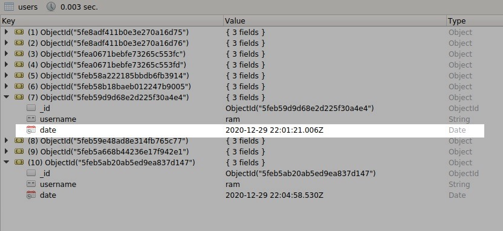

# PyMongo

- How to start `mongodb` process in linux/ubuntu terminal?
    
    Check your system init by `ps --no-headers -o comm 1`
    
    If `systemd` shows up, follow the below commands in your linux terminal to start `mongodb` process. (`systemd` is for recent versions of linux / ubuntu, for older verions it will show <a href="https://docs.mongodb.com/manual/tutorial/install-mongodb-on-ubuntu/#id2">`System V init`</a>)
    - `sudo systemctl start mongod` 
        
        If you receive an error similar to the following when starting mongod
        `Failed to start mongod.service: Unit mongod.service not found.`
        Run the following command first `sudo systemctl daemon-reload`
    
    - Verify `mongodb` has started successfully by using this command `sudo systemctl status mongod`

    - For stopping `mongodb` process, use `sudo systemctl stop mongod` command in the terminal.
        
        

1. <a href = "insert_many.py">Insert Many</a>

2. <a href = "datetime_and_filter_for_pymongo.py">datetime for pymongo</a>

Hypertext REFerence in points.
