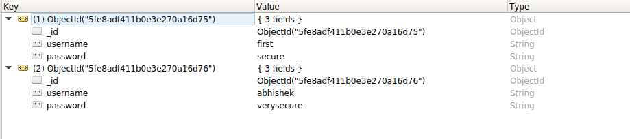

# PyMongo

PyMongo is python library used to manipulate MongoDB.

Reference in Points

1. <a href = "insert_many.py">Insert Many</a>

2. <a href = "datetime_and_filter_for_pymongo.py">datetime for pymongo</a>

